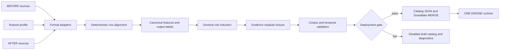

# ONE ENGINE

ONE ENGINE is a Snowflake-native, deterministic rules platform. Its Rules
Distillery repeatedly learns executable rule catalogs from paired BEFORE/AFTER
evidence while preserving row-level provenance, validation results, and prior
runs.

The first ruleset profile is **Product Request**: PRF, SORF, and SRF daily
decision workbooks. Neon is not a runtime dependency.

## Product Request result

The current evidence set contains ten BEFORE workbooks and ten corresponding
AFTER workbooks:

| Measure | Result |
|---|---:|
| Aligned row pairs | 6,922 / 6,922 |
| Unmatched rows | 0 |
| Contradictory identical BEFORE states | 0 |
| Generated rules | 170 |
| Exact accumulated-corpus parity | 100.00% |
| Mean leave-one-date-out accuracy | 69.37% |

These are intentionally separate guarantees. The catalog contains:

- **General rules** learned from reusable filter context and promoted only when
  the leaf is 100% pure with at least three supporting rows.
- **Evidence rules** that close deterministic residuals for previously observed
  BEFORE states.

The combined catalog reproduces every supplied AFTER decision. The temporal
score is the honest estimate for a previously unseen daily file; it is not
represented as 100%. Adding reviewed BEFORE/AFTER pairs and rerunning the
Distillery expands the evidence base and creates a new, independently validated
catalog version.

## How the Rules Distillery works



The engine is not tied to Excel or Product Request. Source adapters currently
accept:

- XLSX/XLSM and other pandas-supported workbook formats
- CSV, TSV, and delimited text
- JSON, JSONL, and NDJSON
- Parquet and Feather when their optional pandas engines are installed
- ZIP archives, directories, or individual files

Every ruleset is configured by a versioned profile defining output fields,
column aliases, identity strategies, matching thresholds, feature budgets,
validation grouping, and an optional feature projector.

## Run the Product Request Distillery

Install the analysis dependencies:

```powershell
py -3 -m pip install -r requirements-distillery.txt
```

Run the full, deployment-gated workflow:

```powershell
py -3 -m one_engine.distillery distill `
  --profile product_request `
  --before before.zip `
  --after after.zip `
  --output catalogs/product_request
```

Use `--skip-holdouts` only for a faster draft iteration. The command exits with
code 2 unless all rows align, accumulated-corpus parity is 100%, and no
contradictory identical states exist.

The current manifest points to a content-addressed run directory containing:

- `report.json` — matching, label, rule, parity, contradiction, and holdout
  diagnostics
- `catalog.json` — executable ONE ENGINE catalog entries
- `load_snowflake.sql` — transactional loader that retires obsolete generated
  rules for this ruleset before merging the current catalog
- `history.json` — retained run lineage and quality metrics

Generated predicates are scoped by `__ruleset_id`, so future workflow catalogs
cannot accidentally execute against Product Request rows.

## Add the next workflow

Do not fork the engine. Add a new profile:

1. Create `one_engine/distillery/profile_catalog/<ruleset>.json`.
2. Declare its output contract, aliases, identity groups, similarity fields,
   induction fields, and validation group.
3. Use the default raw-field projector or register a ruleset-specific projector
   in `one_engine/distillery/rulesets/`.
4. Supply accumulated BEFORE and AFTER sources as matching ZIP members,
   directory files, or individual files.
5. Run the same CLI and require the deployment gate to pass.
6. Add a runtime contract test proving that emitted predicates and actions
   execute through ONE ENGINE.

Raw fields are exposed generically at runtime. Any custom derived feature used
by a new projector must also be registered in that workflow's runtime context.

## Snowflake runtime

- `app/streamlit_app.py` provides ingestion, execution, analyst review,
  reporting, rule administration, simulation, and diagnostics.
- `snowflake/compliance_rules_backend.sql` provisions the seven-table backend.
- Snowpark is the persistence path for batches, rows, rules, runs, results,
  audit events, and reference lists.
- Generated catalogs load into
  `FOODBUY_MASALA_PROD.COMPLIANCE_LAB.COMPLIANCE_RULES_RULES`.

Deployment:

1. Run `snowflake/compliance_rules_backend.sql`.
2. Run the current generated `load_snowflake.sql`.
3. Deploy `app/streamlit_app.py` as the Streamlit in Snowflake main file.
4. Add the packages from `environment.yml`.
5. Use **Settings → Verify backend tables** in ONE ENGINE.

The application never creates backend tables at runtime.

## Verification

Run all contracts:

```powershell
py -3 -m unittest discover -s tests -v
```

The Product Request integration contract verifies:

- all 6,922 rows align;
- the distilled catalog has exact historical parity and no contradictions;
- catalog entries are executable and scoped;
- the same catalog produces all 6,922 expected decisions through the actual
  Streamlit engine.

Do not commit `.env` or `.streamlit/secrets.toml`.
